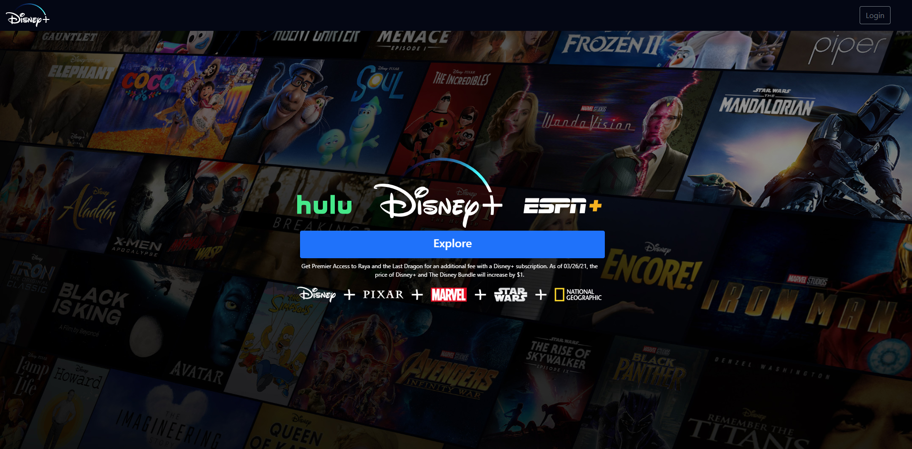

# Disney Hotstar UI Clone

Hotstar-Disney+ UI clone using ReactJS

Most Simple Project you can do when ypu start studying ReactJS.It is only made using ReactJS.



## Installation

need to install git and npm in system

```
git clone https://github.com/anandhu720/disney-hotstar-clone.git

cd disney-hotstar-clone

npm i

npm start

```

## Website link

https://disney-hotstar-beta.vercel.app/

